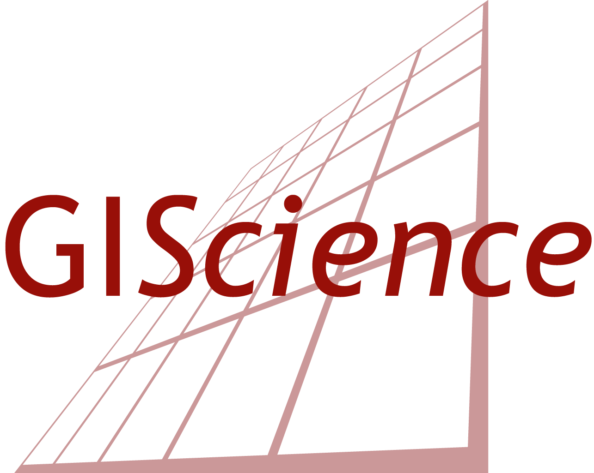

# Workshop on Centrality Indicators in Road Network Analysis: from concept to implementation

*GIScience Conference, Leeds, UK, September 12, 2023*

Centrality indicators are used to identify important nodes or edges in graph networks. Applied to road networks these 
indicators can for example be used to model traffic speed or identify critical roads to support disaster preparedness. 
Still, open challenges remain on how the geographical context of road networks (e.g. road type, spatio-temporal travel 
patterns) should be integrated and how to efficiently calculate centrality indicators for such complex networks. 

This workshop will provide a platform to discuss and learn about centrality indicators both at a conceptual as well as 
a technical implementation level. In addition, hands-on sessions on how to calculate centrality indicators using 
openrouteservice will be offered by the organisers to interested participants. 

### Workshop Format
The workshop will be done in a “open-space” format, where participants themselves suggest topics and decide on the 
agenda. This enables participants to adapt the workshop according to their interests and encourages exchange between 
participants to start new research collaborations. An introduction to the "open space" method will be given at the 
beginning of the workshop. 

**Discussion topics** for the session will be proposed and selected by the participants. Possible topics may be but are 
not limited to:

- How are centrality indicators applied in the geospatial realm? 
- What are current challenges, limitations or open questions?
- How can centrality indicators be adapted, improved or extended?
- Which software packages are available to calculate centrality indicators for road network analysis? What are 
their limitations?
- What are the software requirements to calculate more advanced and meaningful geospatial centrality indicators?
- How to get from conceptual research over proof-of-concepts to ready-to use software to support policy makers?

In addition, **practical hands-on sessions** will be offered by organisers for interested participants:

- What is openrouteservice? How to send API requests
- How to calculate different centrality measures using openrouteservice
- How to set up a local docker instance of openrouteservice on your computer

### Preliminary program

#### Part 1: Focus on conceptual perspective
09:00 – 09:30: Welcome and introduction round  
09:30 – 09:40: Introduction to the “open space” format  
09:40 – 10:00: Collection of discussion topics and agenda planning: focus on conceptual topics   
10:00 – 11:30: Open space sessions (incl. coffee breaks)  
11:30 – 12:00: Group presentation of session results  

LUNCH BREAK

#### Part 2: Focus on technical perspective
13:00 – 13:30: Collection of topics/activities and agenda planning: further discussions, collaborative activities 
inspired by previous discussions, hands-on session on openrouteservice  
13:30 – 15:30: Open space sessions (incl. coffee breaks)  
15:30 – 16:00: Group presentation of session results  

Times are preliminary and will be adapted to the conference schedule.

## Registration
Conference attendees interested in participating in the workshop may **send an email to christina.ludwig@heigit.org until 30.06.2023** with 
a short paragraph explaining their motivation to participate in the workshop . The workshop is limited 
to 20 people.  

Participation in the hands-on tutorials requires participants to bring their own laptop and installing the required 
software prior to the workshop. Installation instructions will be sent out at least two weeks before the conference.

## Workshop organisers
Christina Ludwig, GIScience Research Group, Heidelberg University & Heidelberg Institute for Geoinformation Technology (HeiGIT) gGmbH   
Marcel Reinmuth, Heidelberg Institute for Geoinformation Technology (HeiGIT) gGmbH at Heidelberg University,
Germany   
Adam Rousell, Heidelberg Institute for Geoinformation Technology (HeiGIT) gGmbH at Heidelberg University,
Germany    
Alexander Zipf, GIScience Research Group, Heidelberg University & Heidelberg Institute for Geoinformation Technology (HeiGIT) gGmbH  

HeiGIT and the GIScience Research Group work closely together with the aim of transferring fundamental research in 
geoinformatics to practical applications. Within this collaboration we have performed road network analyses in the 
context of disaster preparedness (Petricola et al., 2022), pedestrian and bike routing (Ludwig et al., 2021, Hatfield 
et al., 2022) and traffic modelling (Zia et al., 2022). All of these studies used openrouteservice, an open-source 
routing service based on OpenStreetMap data, which is developed and provided as a public service by HeiGIT gGmbH.

<table>
	<tr>
		<th></th>
		<th></th>
		<th></th>
	</tr>
</table>

### References

- Hatfield, C., Ludwig,C., Moritz, M., Mukaratirwa, R., Randhawa, S., Reinmuth, M. (2022): [The Green 15-Minute City: 
Submission to the Open Source Software for SDG (OSS4SDG) Hackathon 2022](https://github.com/GIScience/green-15min-city)
- Ludwig, C., Lautenbach, S., Schömann, E. M., & Zipf, A. (2021). [Comparison of Simulated Fast and Green Routes for 
Cyclists and Pedestrians](https://doi.org/10.4230/LIPIcs.GIScience.2021.II.3)  . In 11th International Conference on Geographic Information Science (GIScience 2021)-Part II. 
Schloss Dagstuhl-Leibniz-Zentrum für Informatik.
- Petricola, S., Reinmuth, M., Lautenbach, S. et al. [Assessing road criticality and loss of healthcare accessibility 
during floods: the case of Cyclone Idai, Mozambique 2019](https://doi.org/10.1186/s12942-022-00315-2). Int J Health Geogr 21, 14 (2022).
- Zia, M.; Fürle, J.; Ludwig, C.; Lautenbach, S.; Gumbrich, S.; Zipf, A. [SocialMedia2Traffic: Derivation of Traffic 
Information from Social Media Data](https://doi.org/10.3390/ijgi11090482)
. ISPRS Int. J. Geo-Inf. 2022, 11, 482.

